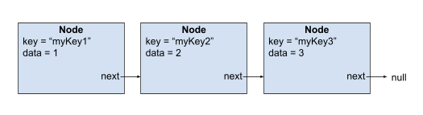

------------------------------------------------------------------------

<td><h1>INF2010 - Structures de données et algorithmes</h1></td>

Merci au cours INF3500 pour le format du Markdown

------------------------------------------------------------------------

Travail pratique \#2
====================

Tables de hachage
=============================================================

Objectifs
---------
* Apprendre le fonctionnement d’une table de hachage

* Comprendre la complexité asymptotique d’une table de hachage

* Utiliser une table de hachage dans un problème complexe

Astuces
--------------------------

Veuillez consulter la section **Astuces** du README du travail pratique 1 pour la configuration du projet.

Partie 1 : Implémentation d'une table de hachage
---------------
Une table de hachage est une structure de données qui utilise une fonction de dispersement (fonction de hashage) pour donner une valeur numérique à une clé qui peut être d’un type quelconque (string, int, MyCustomClass, ..). Cette valeur numérique retournée par la fonction de dispersement est utilisée comme indice dans un tableau, ce qui nous donne un opération d’accès en O(1).

Il arrive que la fonction de dispersement retourne la même valeur numérique pour deux clés différentes. Ce phénomène nommé « collision » est un problème connu des tables de hachage et plusieurs techniques existent pour pallier à ce problème. Dans le cadre de ce laboratoire, l’utilisation de listes chaînées nous permettra de gérer les collisions. La classe «Node» contenue dans HashMap.java vous permettra de créer des listes chaînées de la manière suivante :

Pour bien implémenter ladite table de hachage, suivez les tests contenus dans HashMapTest.java. Aussi, n’oubliez pas d’utiliser hash(KeyType key) comme fonction de dispersement.

Il est recommandé de débuter par l'implémentation des méthodes get() et put() puisque les tests des autres méthodes utilisent ces fonctions afin de valider leur fonctionnement.

**ATTENTION : Une note de 0 sera attribuée à cette partie si l’étudiant utilise une table de hachage déjà implémentée provenant d’une librairie quelconque.**

**NOTE** : Il est possible que le test testComplexityWithBarometeOperation ne passe pas même si vous êtes certain d'avoir la bonne complexité temporelle.
En effet, ce test ce base sur le nombre de fois ou vous appelez la fonction equals() pour comparer deux clé de votre hashMap. Donc si vous avez des appels inutiles
de equals() le test ne passera probablement pas.

**Itérateur** : Dans ce tp il vous sera demandé d'implémenté des itérateurs pour vos structures de données. Vous pouvez consulté le lien suivant afin d'obtenir plus
d'information.

https://www.w3schools.com/java/java_iterator.asp  
https://refactoring.guru/design-patterns/iterator
------------------------------------------------------------------------

Partie 2 : Problème typique d'entrevue
----------------

On vous demande d'implémenter un algorithme d'analyse de phrase.
Dans celui-ci on vous donne une séquence de mots séparée par des espaces et on vous demande de trouver le terme le plus populaire, qui n'est pas un mot sans intérêt (*stop word*), et son nombre d'occurences.

Votre algorithme devra également suivre ses consignes:
* Il ne devrait pas être sensible aux majuscules et aux minuscules (*case insensitive*). Ex: MA ma Ma mA doivent être reconnu comme étant le même mot.
* Il devra toujours **retourner le mot en minuscule**.
* En cas d'égalité dans le nombre d'occurences entre 2 mots ou plus, il faut choisir le mot en se basant sur l'ordre alphabétique. Ex: arbre aura priorité sur ballon en cas d'égalité entre les deux.

**Note: Votre algorithme n'a pas besoin de tenir compte de la ponctuation ou des accents**

### Entrées
* Un string de n caractères contenant une phrase et un tableau de string de m caractères contenant les mots sans intérêts.
* Voici un exemple d'une phrase: "INF2010 est le meilleur cours de Polytechnique"
* Voici un exemple du tableau contenant les mots sans intérêt: ["est", "le", "de"]

### Sorties
* Une paire contenant un String et un entier (ex : Pair{first = "netflix"; second = 999;})
* Le premier indique **en minuscule** le mot d'intérêt le plus populaire dans la phrase
* Le second indique le nombre d'occurences de ce mot dans la phrase

**Note: La classe Pair est fournit dans le code de départ**

### Contraintes
Supposons n le nombre de caractères dans la phrase et m le nombre de caractères dans le tableau de mots sans intérêts
* Complexité spatiale : O(n+m) en pire cas
* Complexité temporelle : O(n+m) en cas moyen

Vous devez brievement justifiez votre complexité spatiale et temporelle dans l'en-tête de la fonction _findMostCommonValidWord_

**Seul l'utilisation de la librairie java.util est permise pour cette partie**

------------------------------------------------------------------------

### Exemple 1
Entrées : "Tu devrais regarder Arcane Arcane est vraiment bon." et ["tu", "est"]

Sorties : Pair{first = "arcane"; second = 2;}

Explication :

Dans cette phrase, le mot "Arcane" est répété 2 fois alors que les autres mots sont répétés 1 fois.

Le mot "Arcane" ne figure pas dans la liste de mots sans intérêts et il est retourné en minuscule.

------------------------------------------------------------------------

Entrées : "As tu regarde Squid Game Oui jai vu Squid Game hier As" et ["As", "est"]

Sorties : Pair{first = "game"; second = 2;}

Explication :

Dans cette phrase, les mots "Squid", "Game" et "As" sont répétés 2 fois alors que les autres mots sont répétés 1 fois.

Comme le mot "As" est un mot sans intérêt, on se retrouve avec "Squid" et "Game". Comme il y a une égalité d'occurences entre les deux, on choisit "Game" puisque g vient avant s.

Le mot est retourné en minuscule.

------------------------------------------------------------------------

Entrées : "Il faut arreter Jinx Jinx" et ["il", "FAUT", "arreter", "jinx"]

Sorties : Pair{first = null; second = null}

Explication :

Dans cette phrase, le mot "Jinx" est répété 2 fois alors que les autres mots sont répétés 1 fois, mais ce mot est dans la liste de mots sans intérêts. Même s'il est en minuscule, l'algorithme considère que Jinx et jinx sont un même mot (même principe pour faut et FAUT).

Tous les autres mots de la phrase sont des mots sans intérêts et donc on retourne null pour indiquer qu'il n'y a pas de réponse.

------------------------------------------------------------------------

Barème de correction
--------------------

||||
|-----------------|-----------------------------|-----|
| Partie 1        | Réussite des tests          | /13 |
| Partie 2        | Réussite des tests          | /2  |
|                 | Complexité attendue         | /2  |
|                 | Justification de complexité | /2  |
| Qualité du code |                             | /1  |
| Total           |                             | /20 |

Un chargé s’assurera que votre code ne contourne pas les tests avant de vous attribuer vos points dans la catégorie «Réussite des tests». Il est important de respecter les complexités en temps mises dans la description de chaque fonction.

Pour avoir tous les points dans la catégorie « Complexité en temps » de la partie 2, vous devez réaliser un algorithme respectant les commentaires situés dans `InterviewTest.java`.

**ATTENTION : Pour la Partie 1, une fonction n’ayant pas la bonne complexité entraîne la perte des points de tous les tests utilisant cette fonction.**

------------------------------------------------------------------------

**Correction automatique** : Les tests sont un bon moyen d'évaluer votre note avant la remise. Néanmoins, l’entièreté
de votre code sera révisée par un chargé de laboratoire pour s'assurer qu'il réalise véritablement les tâches demandées.
Il peut donc y avoir des différences entre la note donnée par vos tests et votre note finale.

##### Qu'est-ce que du code de qualité ?
* Absence de code dédoublé (FAITES DES FONCTIONS!!!)
* Absence de *warnings* à la compilation
* Absence de code mort : Code en commentaire, variable inutilisé, etc...
* Respecte les mêmes conventions de codage dans tout le code produit
  * Langue utilisée
  * Noms des variables, fonctions et classes
* Variables, fonctions et classes avec des noms pertinents et clairs qui expliquent leur intention et non leur comportement

**Petite astuce:** Utiliser les fonctionnalités offertes par Intellij!

Le dernier commit de votre répertoire sera utilisé comme remise finale. Chaque jour de retard créera une pénalité
additionnelle de 20 %. Aucun travail ne sera accepté après 4 jours de retard.

**Date de remise: 25 mai, 23h59**

