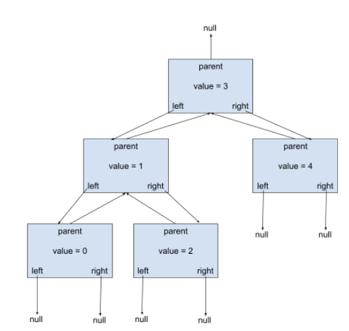
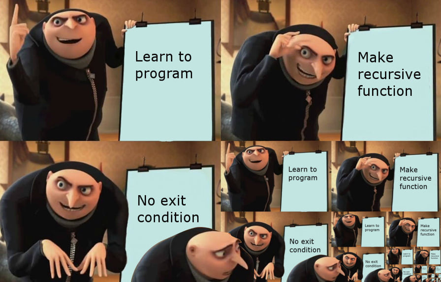
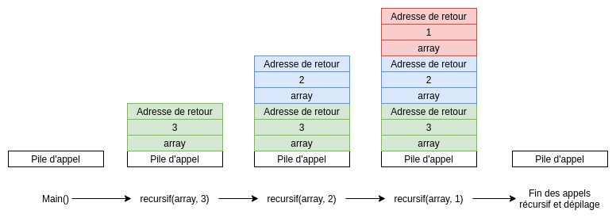

------------------------------------------------------------------------


<td><h1>INF2010 - Structures de données et algorithmes</h1></td>

Merci au cours INF3500 pour le format du Markdown

------------------------------------------------------------------------

Travail pratique \#3
====================

Arbre Binaire de recherche
=============================================================

Objectifs
---------
* Apprendre le fonctionnement d’un arbre binaire de recherche

* Comprendre la complexité asymptotique d’un arbre binaire de recherche

* Utiliser les concepts associés aux arbres binaires dans un problème complexe

Astuces
-------
Veuillez consulter la section **Astuces** du README du travail pratique 1 pour la configuration du projet.

------------------------------------------------------------------------

Partie 1 : Implémentation d'une table de hachage
---------------
Un arbre AVL est un arbre binaire de recherche équilibré. Celui-ci oblige que la différence entre la hauteur gauche et la hauteur droite soit inférieure à 2. Si cette condition n’est pas respectée, il vous faut rééquilibrer l’arbre avec l’algorithme des arbres AVL. Dans le cas du retrait d’un élément, une démarche spécifique doit être utilisée. L’explication de ces algorithmes sont disponibles dans les diapositives **Cours05** et **Cours06**.

L’arbre AVL sera composé d’un ensemble de BinaryNodes ayant un lien ascendant vers leur parent. Voici un exemple d’un arbre AVL utilisant celles-ci.



Pour bien implémenter l’arbre AVL, suivez les tests contenus dans AvlTreeTester.java dans l’ordre de leur définition. Aussi, n’oubliez pas que root est un cas d’exception pour la plupart des fonctions à implémenter.

**ATTENTION : Une note de 0 sera automatiquement attribuée si vous utilisez un arbre binaire d’une librairie quelconque.**

**Certaines fonctions doivent obligatoirement être implémentées de manière itérative (non-récursif). Celles-ci sont identifiées avec le commentaire suivant  _'HAS TO BE ITERATIVE, NOT RECURSIVE'_**

**Lorsqu'il est demandé `TODO: What's the average case? Briefly explain`, vous devez brievement justifier votre réponse. Vous pouvez mettre votre réponse directement en entête de la fonction.**

------------------------------------------------------------------------

Partie 2 : Problème typique d'entrevue 🥶😳
----------------

On vous demande d'élaborer un algorithme répondant à la question d'entrevue suivante de trois manières différentes.
Premièrement de façon itérative en temps linéaire dans la fonction `findNonDuplicateIterativeLinear`, ensuite de matière itérative en temps logarithme dans la fonction `findNonDuplicateIterative` et enfin de manière récursive dans la fonction `findNonDuplicateRecursive`.

Pour chacune des implémentations, on vous demande bien de respecter la contrainte de complexité temporelle et d'expliquer celle-ci.
De plus, on vous demande de déterminer et d'expliquer la complexité spatiale de chacune des implémentations. Dans les deux cas, on vous demande de justifier le pire cas ainsi que le cas moyen.
L'objectif d'avoir trois implémentations différentes est d'observer les différences dans la complexité spatiale et temporelle.

### Entrées
* Un tableau d'entier trié en ordre croissant composé que de doublons à l'exception d'un nombre (ex : [1, 1, 2, 4, 4])

### Sorties
* Un entier contenant le nombre qui est seul (sans un doublons)

### Contraintes
Supposons un tableau de taille n
* Complexité temporelle : O(n) en pire cas pour la fonction  la fonction `findNonDuplicateIterativeLinear`
* Complexité temporelle : O(log(n)) en pire cas pour les deux autres
* Complexité spatiale en pire et en moyen cas : À vous de la déterminer et de vous justifier

Si le tableau ne contient pas d'éléments, il faut retourner *null*.

Si le tableau contient au moins un éléments, vous pouvez assumer qu'il y aura seulement 1 élément seul.

**Il est permis d’utiliser la librairie java.util pour cette partie. Une note de 0 sera attribuée à cette partie si l’étudiant utilise quelconque autre librairie.**

------------------------------------------------------------------------

### Exemple 1
Entrées :
* Tableau : [1, 1, 5, 6, 6]

* Sorties : 5

Explication :

L'entier 5 est le seul qui n'a pas un doublons (il est seul dans le tableau).

------------------------------------------------------------------------

### Exemple 2
Entrées :
* Tableau : [1]

* Sorties : 1

Explication :

L'entier 1 est tout seul dans le tableau

------------------------------------------------------------------------

### Exemple 3
Entrées :
* Tableau : []

* Sorties : null

Explication :

Le tableau ne contient aucun élément et donc, comme il n'y a pas de réponse, on retourne null;

------------------------------------------------------------------------

Récursion
--------------------


Afin de déterminer la complexité spatiale d'une fonction récursive, il est important de comprendre le concept de la pile d'appels.

La pile d'appels est l'endroit en mémoire ou notre programme sauvegarde les appels aux fonctions ainsi que les paramètres de celles-ci.
Lors de l'utilisation d'une fonction récursive, les paramètres sont empilés à nouveau sur la pile à chaque appel récursif. L'espace
mémoire utilisé est donc plus grand lors d'une implémentation récursive comparée à une implémentation itérative.

Voici un exemple pour mieux illustrer la pile d'appel pour une fonction récursive.

Soit le code suivant
```java
class Main {
    public static void Main() {
        recursif(new Integer[] {1, 2, 3}, 3);
    }
    
    public static Integer[] recursif(Integer[] array, int number) {
        number--;
        if (number > 0)
            return recursif(array, number);
        
        return array;
    }
}
```

La pile d'appel lors de l'exécution de la fonction main serait la suivante



Barème de correction
--------------------

||||
|-----------------|-----------------------------|-----|
| Partie 1        | Réussite des tests          | /7 |
|                 | Justification de complexité | /2  |
|                 | Qualité du code             | /2  |
| Partie 2        | Réussite des tests          | /4  |
|                 | Justification de complexité | /3  |
|                 | Qualité du code             | /2  |
| Total           |                             | /20 |

Un chargé s’assurera que votre code ne contourne pas les tests avant de vous attribuer vos points dans la catégorie «Réussite des tests». Il est important de respecter les complexités en temps mises dans la description de chaque fonction.

Pour avoir tous les points dans la catégorie « Complexité en temps » de la partie 2, vous devez réaliser un algorithme respectant les commentaires situés dans `Interview.java`.

**ATTENTION : Pour la Partie 1, une fonction n’ayant pas la bonne complexité entraîne la perte des points de tous les tests utilisant cette fonction.**

------------------------------------------------------------------------

**Correction automatique** : Les tests sont un bon moyen d'évaluer votre note avant la remise. Néanmoins, l’entièreté
de votre code sera révisée par un chargé de laboratoire pour s'assurer qu'il réalise véritablement les tâches demandées.
Il peut donc y avoir des différences entre la note donnée par vos tests et votre note finale.

##### Qu'est-ce que du code de qualité ?
Consulter ce lien pour des détails sur les bonnes pratiques: https://drive.google.com/drive/folders/14RHZZgxQx5ftTdNwSdQGOWYrXxmB6s3r?usp=sharing
* Absence de code dédoublé (FAITES DES FONCTIONS!!!)
* Absence de *warnings* à la compilation
* Absence de code mort : Code en commentaire, variable inutilisé, etc...
* Respecte les mêmes conventions de codage dans tout le code produit
  * Langue utilisée
  * Noms des variables, fonctions et classes
* Variables, fonctions et classes avec des noms pertinents et clairs qui expliquent leur intention et non leur comportement

**Petite astuce:** Utiliser les fonctionnalités offertes par IntelliJ!

Le dernier commit de votre répertoire sera utilisé comme remise finale. Chaque jour de retard créera une pénalité
additionnelle de 20 %. Aucun travail ne sera accepté après 4 jours de retard.

**Date de remise: 1 juin, 23h59**
