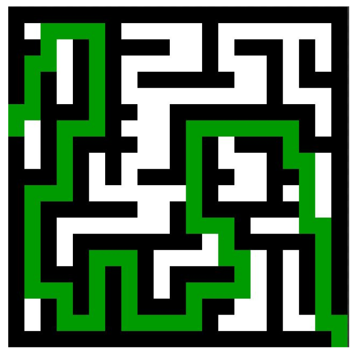
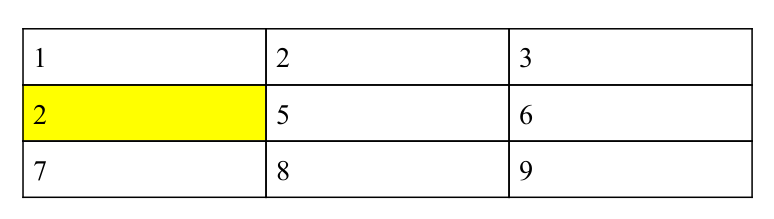
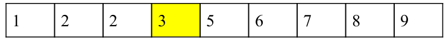

------------------------------------------------------------------------

<td><h1>INF2010 - Structures de données et algorithmes</h1></td>

Merci au cours INF3500 pour le format du Markdown

------------------------------------------------------------------------

Travail pratique \#5
====================

*Graphes* et problèmes typiques d'entrevues
=============================================================

Objectifs
---------
* Apprendre le fonctionnement d’un *graphe*

* Comprendre la complexité temporelle et spatiale d’un
  algorithme qui utilise des *graphes*

* Utiliser les concepts associés aux graphes dans des problèmes
  complexes

Préparation au laboratoire
--------------------------
Pour ce laboratoire, il est recommandé d’utiliser l’[IDE IntelliJ](https://www.jetbrains.com/fr-fr/idea/download/) 
offert par JetBrains. Vous avez accès à la version complète (Ultimate) en tant qu’étudiant à Polytechnique Montréal. 
Il suffit de vous créer un compte étudiant en remplissant le [formulaire d'inscription étudiante](https://www.jetbrains.com/shop/eform/students).

------------------------------------------------------------------------

Question d’entrevue 1 : Alphabet
---------------
À partir des mots contenue dans le dictionnaire d'une langue fictive, on vous demande de déterminer l'ordre lexical des symboles dans  celle-ci, c'est à dire
l'ordre alphabétique des symboles propre à cette langue. 

*RAPPEL :* Les mots dans une dictionnaire sont ordonnées selon leur ordre lexical

### Entrées
* Un tableau de mots dans leur ordre d'apparition dans le dictionnaire

### Sortie
* Un tableau de *Character* contenant les symboles de la langue triés selon leur ordre lexical (Ordre alphabétique propre à cette langue)

### Exemple 1 : Anglais Simplifié
Supposons un langue anglaise simplifé contenant seulement les mots dans le dictionnaire suivant :
  * arc
  * are
  * ark
  * bark
  * cake
  * car
  * ear

Puisque celui-ci est en ordre lexical, on peut en déduire que :
* La lettre a vient avant la lettre b
* La lettre b vient avant la lettre c
* La lettre e vient avant la lettre k
* etc...

Il est donc possible de déduire que l'ordre lexical de cet anglais simplifié qui est
['a', 'b', 'c', 'e', 'k']

### Exemple 2 : Langue imaginaire
Supposons une langue imaginaire contenante seulement les mots dans le dictionnaire suivant :
* ]?4
* ]]b
* {4?
* {4{
* 4?{
* 4?b
* b]]

Puisque celui-ci est en ordre lexical, on peut en déduire que :
* La lettre ? vient avant la lettre ]
* la lettre ] vient avant la lettre {
* la lettre { vient avant la lettre 4
* etc...

Il est donc possible de déduire que l'ordre lexical de cette langue est :
['?', ']', '{', '4', 'b']

### Autre information utile
Des classes Graph et Vertex on déjà été implémenté pour vous afin de facilité la résolution de ce problème.
Aller bien lire leur fonctionnement et leurs interfaces publique car elle pourront vous êtres utile lors de la résolution
de ce problème.

------------------------------------------------------------------------

Question d’entrevue 2 : Solveur de labyrinthe
---------------
Cet algorithme permet de trouver la longueur du chemin le plus court
pour sortir d'un labyrinthe.
* **Carte de jeu** *maze* : Planche de jeu composée de carreau de labyrinthe
* **Carreau de labyrinthe** *Tile* : Sous-partie du labyrinthe représentant un morceau de plancher, un mur ou une entrée/sortie

Votre chemin doit commencer au point d'entrée et terminer au point de sortie . Les points d'entrée et sortie sont interchangeables. 
Votre chemin ne peut pas passer sur un carreau de labyrinthe qui est un mur.
L'entrée et la sortie du labyrinthe sont toujours sur les bords de celui-ci.

### Entrées
* Matrice de forme M x N (attribut _maze_ ) où chaque valeur représente une sous-partie (Plancher, mur ou entrée/sortie)

### Sortie
* Distance du chemin le plus court pour résoudre le labyrinthe

Pour bien implémenter l’algorithme, suivez les tests contenus dans
MazeTest.java **dans l’ordre de leur définition**.

------------------------------------------------------------------------

Question d’entrevue 3 : Ke plus petit élément
----------------
### Entrées
* Matrice de forme M x N (attribut *matrix*) où chaque valeur doit respecter les règles suivantes :
  * matrix[i][j] <= matrix[i + 1][j]
  * matrix[i][j] <= matrix[i][j + 1]
* Entier (attribut *k*) représentant la position de la valeur à retourner si la matrice serait mise dans un tableau 1D trié.

### Sorties
* Élément à la position *k* si la matrice était mise dans un tableau 1D trié. En d’autres mots, on retourne le ke plus petit élément de ​ matrix . ​

Pour bien implémenter l’algorithme, suivez les tests contenus dans
KthSmallestElementTest.java **dans l’ordre de leur définition**.

### Contraintes
Supposons une matrice ( *matrix* ) de forme quelconque M x N.
* Complexité temporelle (temps) : O( k log max(m, n) )
* Complexité spatiale (mémoire) : O( max(m, n) )

Expliquez la complexité de votre algorithme dans l’en-tête de la
fonction *findKthSmallestElement*.

### Exemple
Supposons *k* = 3

Pour bien implémenter l’algorithme, suivez les tests contenus dans
KthSmallestElementTest.java **dans l’ordre de leur définition**.

Consigne Supplémentaire
--------------------

Dans ce laboratoire, il sera particulièrement important d’avoir un code bien auto documenté en encapsulant certains comportements dans des fonctions ou même des classes. 
**La seule restriction est de ne pas modifier l’API public**. Toutes autres modifications sont autorisées.

Par exemple :
* Ajouter une fonction privée
* Ajouter un attribut privé
* Créer une classe
* Créer un enum
* ...

Si vous décidez de créer de nouveaux fichiers, mettez-les dans le dossier associé à la question qui les utilise.

Barème de correction
--------------------

||||
|---------------------------------|---------------------------|-----|
| Alphabet                        | Réussite des tests        | /4  |
| Qualité du code                 |                           | /1  |
| Détaille mon monde              | Réussite des tests        | /4  |
| Qualité du code                 |                           | /1  |
| ke plus petit élément| Réussite des tests        | /4  |
|                                 | Complexité et explication | /6  |
| Total           |                                           | /20 |

**Correction automatique** : Les tests sont un bon moyen d'évaluer votre note avant la remise. Néanmoins, l’entièreté 
de votre code sera révisée par un chargé de laboratoire pour s'assurer qu'il réalise véritablement les tâches demandées.
Il peut donc y avoir des différences entre la note donnée par vos tests et votre note finale.

### Qu'est-ce que du code de qualité ?
* Absence de code dédoublé
* Absence de *warnings* à la compilation
* Absence de code mort
* Respecte les mêmes conventions de codage dans tout le code produit
  * Langue utilisée
  * Noms des variables, fonctions et classes
* Variables, fonctions et classes avec des noms qui expliquent leur intention et non leur comportement
* Création de fonctions privées pour diminuer la répétition de code
* Création de classes pour isoler des comportements

Vous ne pouvez jamais changer l'API public des classes fournies.

Le dernier commit de votre répertoire sera utilisé comme remise finale. Chaque jour de retard créera une pénalité 
additionnelle de 20 %. Aucun travail ne sera accepté après 4 jours de retard.

La remise sera le 15 Juin à 23h59.
